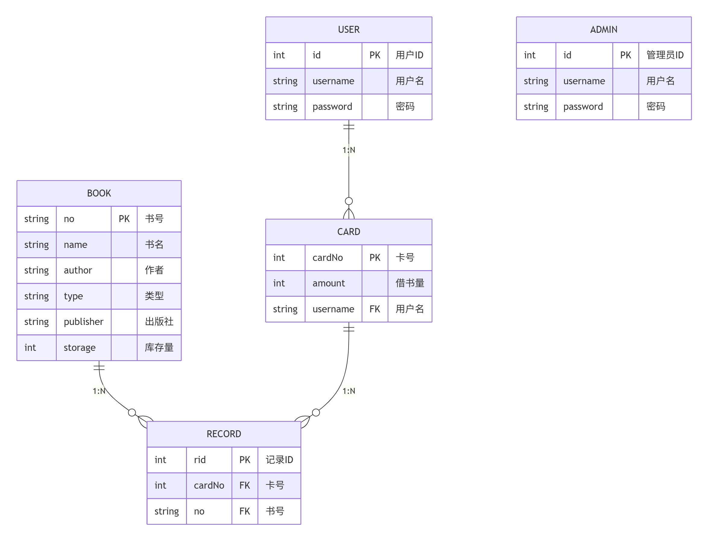

# 图书管理系统（Book Management System）

一个基于 **Java Swing + MySQL + JDBC** 实现的桌面图书管理系统。

项目提供管理员、普通用户和访客三种使用模式，覆盖图书查询、图书维护、用户管理、借书证管理、图书借阅与归还等基本业务。界面使用 Java Swing 编写，数据通过 JDBC 持久化到 MySQL。

## 项目功能

### 管理员模式

管理员登录后可以进行以下操作：

- 查询图书信息
- 新增、修改和删除图书
- 管理借书证
- 一键归还指定借书证下的全部图书
- 注销借书证
- 管理普通用户
- 添加和删除管理员账户

### 用户模式

普通用户可以注册并登录系统，登录后可以：

- 按书号、书名、作者、类型或出版社查询图书
- 借阅图书
- 归还图书
- 办理借书证
- 查看本人持有的借书证
- 查看各借书证对应的借阅记录

当前业务规则中：

- 每个用户最多办理 **5 张借书证**
- 每张借书证最多同时借阅 **10 本图书**

### 访客模式

访客无需登录即可进入系统查询图书，但不能执行借阅、归还或账户相关操作。

## 技术栈

| 技术 | 用途 |
| --- | --- |
| Java | 项目主要开发语言 |
| Java Swing | 桌面 GUI |
| MySQL | 数据持久化 |
| JDBC | Java 与 MySQL 的数据库连接 |
| MySQL Connector/J 8.0.27 | MySQL JDBC 驱动 |
| IntelliJ IDEA | 推荐开发与运行环境 |

## 项目结构

```text
book-manage-system/
├── ER.png
├── README.md
└── bms/
    ├── JDBC/
    │   └── mysql-connector-java-8.0.27.jar
    └── src/
        ├── Main.java
        ├── dao/
        │   ├── BookDao.java
        │   ├── CardDao.java
        │   ├── RecordDao.java
        │   └── UserDao.java
        ├── model/
        │   ├── Book.java
        │   ├── Card.java
        │   ├── Record.java
        │   └── User.java
        ├── util/
        │   ├── JDBC.java
        │   └── Str.java
        ├── view/
        │   └── ...
        └── image/
            └── ...
```

主要代码分层如下：

- `model`：保存用户、图书、借书证和借阅记录等实体对象。
- `dao`：负责数据库查询、插入、更新和删除操作。
- `view`：Swing 图形界面以及界面事件处理。
- `util`：数据库连接和通用工具类。
- `image`：程序界面使用的本地图标资源。
- `Main.java`：程序入口。

## 数据库设计

系统主要使用 5 张数据表：

| 表名 | 作用 |
| --- | --- |
| `user` | 普通用户账户 |
| `auser` | 管理员账户 |
| `book` | 图书信息与库存 |
| `card` | 借书证信息 |
| `record` | 图书借阅记录 |

### ER 图



### 数据表关系

- 一个用户可以拥有多张借书证。
- 一张借书证属于一个用户。
- 一张借书证可以产生多条借阅记录。
- 一本图书可以出现在多条借阅记录中。
- `record` 用于关联 `card` 与 `book`。

## 环境要求

建议准备以下环境：

- JDK 8 或更高版本
- MySQL 8.x
- IntelliJ IDEA
- MySQL Connector/J 8.0.27

项目中已经包含：

```text
bms/JDBC/mysql-connector-java-8.0.27.jar
```

## 数据库初始化

### 1. 创建数据库

在 MySQL 中执行：

```sql
CREATE DATABASE library
    CHARACTER SET utf8mb4
    COLLATE utf8mb4_general_ci;

USE library;
```

### 2. 创建数据表

```sql
CREATE TABLE user (
    id INT PRIMARY KEY AUTO_INCREMENT,
    username VARCHAR(45) NOT NULL UNIQUE,
    password VARCHAR(45) NOT NULL
);

CREATE TABLE auser (
    id INT PRIMARY KEY AUTO_INCREMENT,
    username VARCHAR(45) NOT NULL UNIQUE,
    password VARCHAR(45) NOT NULL
);

CREATE TABLE book (
    no VARCHAR(45) PRIMARY KEY,
    name VARCHAR(45) NOT NULL,
    author VARCHAR(45) NOT NULL,
    type VARCHAR(45) NOT NULL,
    publisher VARCHAR(45) NOT NULL,
    storage INT NOT NULL DEFAULT 0
);

CREATE TABLE card (
    cardNo INT PRIMARY KEY AUTO_INCREMENT,
    amount INT NOT NULL DEFAULT 0,
    username VARCHAR(45) NOT NULL,
    CONSTRAINT fk_card_user
        FOREIGN KEY (username) REFERENCES user(username)
);

CREATE TABLE record (
    rid INT PRIMARY KEY AUTO_INCREMENT,
    cardNo INT NOT NULL,
    no VARCHAR(45) NOT NULL,
    CONSTRAINT fk_record_card
        FOREIGN KEY (cardNo) REFERENCES card(cardNo),
    CONSTRAINT fk_record_book
        FOREIGN KEY (no) REFERENCES book(no)
);
```

### 3. 创建初始管理员

首次运行前需要至少创建一个管理员账户，例如：

```sql
INSERT INTO auser(username, password)
VALUES ('admin', '123456');
```

该账户仅作为本地测试示例，实际使用时请自行修改用户名和密码。

## 配置数据库连接

打开：

```text
bms/src/util/JDBC.java
```

根据本机 MySQL 环境修改数据库连接参数：

```java
private String url = "jdbc:mysql://localhost:3306/library?&useSSL=false&serverTimezone=UTC";
private String user = "root";
private String password = "你的MySQL密码";
```

如果 MySQL 不在本机、端口不是 `3306`，或者数据库名称发生变化，也需要同步修改 `url`。

## 主要业务流程

### 用户借阅

```text
用户登录
  ↓
查询图书
  ↓
选择图书
  ↓
输入借书证和密码
  ↓
验证借书证归属及借阅上限
  ↓
生成借阅记录
  ↓
借书证借阅数量 +1
  ↓
图书库存 -1
```

### 用户归还

```text
用户登录
  ↓
输入借书证和书号
  ↓
验证借阅记录
  ↓
删除借阅记录
  ↓
借书证借阅数量 -1
  ↓
图书库存 +1
```

## 核心模块

### 图书管理

`BookDao` 负责图书数据操作，包括：

- 图书新增
- 库存增加或减少
- 图书条件查询
- 图书信息修改
- 图书删除

如果图书仍存在未归还的借阅记录，系统会阻止直接删除该图书。

### 借书证管理

`CardDao` 和 `RecordDao` 负责借书证及借阅关系，包括：

- 办理借书证
- 查询用户借书证
- 验证借书证归属
- 检查借阅数量上限
- 注销借书证
- 一键归还全部图书

存在未归还图书时，借书证不能直接注销。

### 用户与管理员管理

`UserDao` 负责：

- 普通用户登录
- 普通用户注册
- 管理员登录
- 管理员新增
- 管理员删除

管理员还可以通过系统界面对普通用户进行管理。

## 界面说明

项目使用 Java Swing 实现桌面交互界面，主要包含：

- 系统启动页
- 用户登录 / 注册页
- 管理员登录页
- 用户主界面
- 管理员主界面
- 图书查询界面
- 图书管理界面
- 图书借阅界面
- 图书归还界面
- 借书证办理与查看界面
- 借书证管理界面
- 用户管理界面
- 管理员管理界面

## 注意事项

1. 项目启动前必须先启动 MySQL。
2. 数据库名称默认为 `library`。
3. JDBC 驱动必须加入 IntelliJ IDEA 的模块依赖，否则会出现 MySQL Driver 找不到的问题。
4. 数据库连接失败时，优先检查 `JDBC.java` 中的 URL、用户名和密码。
5. 图书库存、借书证借阅数量和借阅记录之间存在关联，不建议直接在数据库中随意修改这些字段。
6. 本项目为桌面端 Java 项目，不需要部署 Web 服务器。

## License

本项目主要用于 Java、Swing、JDBC 与 MySQL 的学习和实践。
